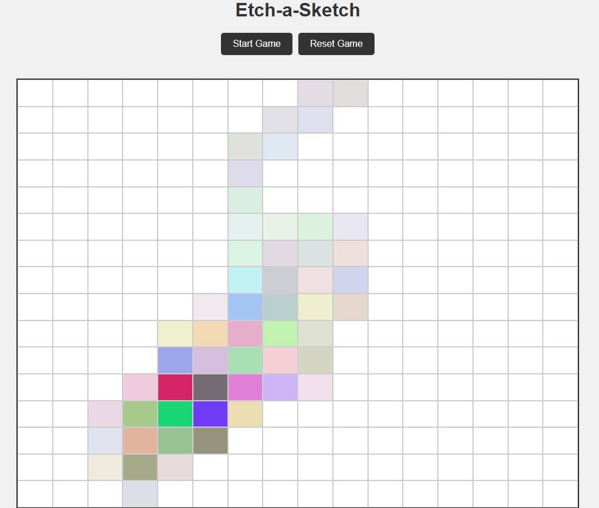

# Etch-a-Sketch Project

## Description  
A browser-based version of the classic sketchpad toy. Built with clean **HTML**, **CSS**, and **JavaScript**, this project lets you draw on a dynamic grid directly in your browser.

## Live Preview  
👉 https://woodheadbear.github.io/etch-a-sketch/

## Features  
- Adjustable grid size (1–100)  
- Interactive hover drawing  
- Reset functionality  
- Simple and clean UI  

## Instructions  
1. Click the **Start Game** button.  
2. Enter a grid size between **1 and 100**.  
3. Move your mouse over the grid to start drawing.  
4. Click **Reset Game** to clear the board.

## Preview  


## Tech Stack  
- HTML  
- CSS  
- JavaScript  

## Installation  
Clone the repository and open `index.html` in your browser.

```bash
git clone <your-repo-url>
cd <your-repo-folder>
open index.html